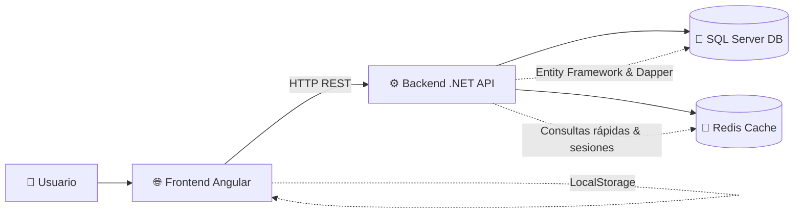
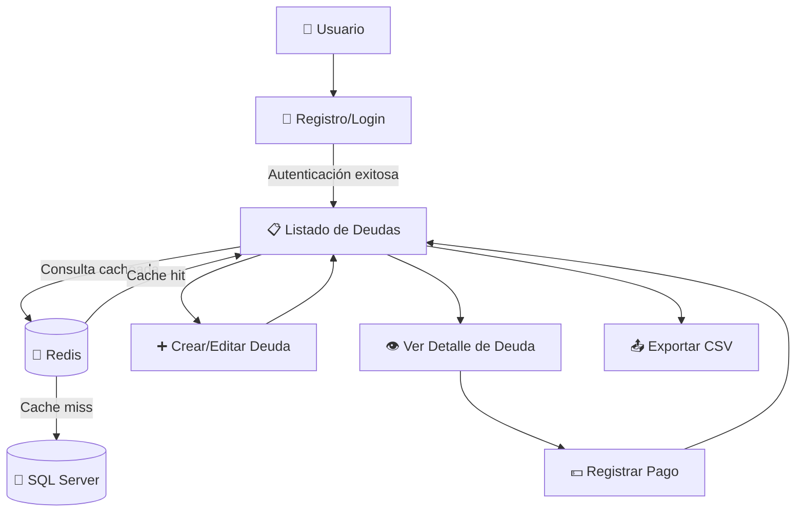

# 💰 Finanzas

_Sistema de gestión de deudas y pagos — Frontend en **Angular 17** + Backend en **.NET 9**_

<p align="center">
  
  
  
  
  
</p>

---

## 📌 Requisitos

- Node.js >= 18  
- .NET >= 9.0  
- Angular >= 17  
- SQL Server  
- Redis (para cacheo de consultas y sesiones)  

---

## ⚙️ Instalación

### 🔹 Backend (API)
1. Clona el repositorio del backend.  
2. Ejecuta el script de base de datos en la carpeta `scriptdb`.  
3. Instala los paquetes NuGet necesarios (`Microsoft.AspNetCore.Cors`, `StackExchange.Redis`, etc).  
4. Configura la cadena de conexión en `appsettings.json`.  
5. Ejecuta las migraciones:  
   ```bash
   dotnet ef database update
   ```
6. Inicia la API:  
   ```bash
   dotnet run
   ```
7. Disponible en: `http://localhost:5000/api`  

### 🔹 Frontend (UI)
1. Clona este repositorio (UI).  
2. Instala dependencias:  
   ```bash
   npm install
   ```
3. Inicia Angular:  
   ```bash
   npm start
   ```
4. Abre en el navegador: `http://localhost:4200`  

---

## 🛠️ Detalles técnicos

- **Frontend:** Angular standalone, Angular Material, Signals, TypeScript.  
- **Backend:** .NET 9, Entity Framework, SQL Server, Dapper.  
- **Cache:** Redis para cacheo de consultas y persistencia temporal.  
- **Autenticación:** Login y registro, sesión persistida en LocalStorage.  
- **Gestión de deudas:** CRUD de deudas, registrar pagos, exportar CSV.  
- **Validaciones:** Formularios reactivos, mensajes de error dinámicos.  
- **Estilos:** Diseño moderno, monocromático (blanco y negro), responsivo.  

---

## 🚀 Funcionalidad

✔ Registro y login de usuarios  
✔ Creación y edición de deudas  
✔ Listado filtrable por estado  
✔ Registro de pagos asociados  
✔ Exportación de deudas a CSV  
✔ Cache de consultas con Redis  
✔ Validaciones en formularios  

---

## 📡 Endpoints principales (API)

- **POST /Usuario/login** → Autenticación  
- **POST /Usuario/registrar** → Registro de usuario  
- **GET /Deuda/consultar/{usuarioId}** → Listado de deudas  
- **POST /Deuda/registrar** → Nueva deuda  
- **POST /Pago/registrar** → Nuevo pago  

📌 **Ejemplo de respuesta:**  

```json
[
  {
    "Nombre": "Carlos Pérez",
    "DeudaId": 1,
    "MontoTotal": 500000,
    "TotalPagado": 200000,
    "SaldoPendiente": 300000,
    "Estado": "Parcial"
  },
  {
    "Nombre": "Ana Torres",
    "DeudaId": 2,
    "MontoTotal": 150000,
    "TotalPagado": 150000,
    "SaldoPendiente": 0,
    "Estado": "Pagada"
  }
]
```

---

## 🏗️ Arquitectura



---

## 🔄 Flujo de Usuario



---

## 📸 Capturas

<p align="center">
  
  
  
  
  
  
  


</p>

---

## ❓ FAQ

**¿Cómo configuro la base de datos?**  
Edita `appsettings.json` y corre:  
```bash
dotnet ef database update
```

**¿Cómo configuro Redis?**  
- Instala Redis localmente o en un contenedor Docker:  
  ```bash
  docker run -d --name redis -p 6379:6379 redis
  ```  
- Configura la conexión en `appsettings.json` bajo `"Redis:ConnectionString"`.  

**¿Cómo soluciono problemas de CORS?**  
Revisa la configuración en `Program.cs` o `Startup.cs`.  

**¿Cómo exporto deudas a CSV?**  
Haz clic en **"Exportar CSV"** en la UI.  

**¿Cómo reporto un bug o mejora?**  
Abre un issue en el [repositorio](https://github.com/jhohanvasquez/Finanzas).  

---

## 👨‍💻 Autor

**Jhohan Vasquez**  
📌 [Repositorio oficial](https://github.com/jhohanvasquez/Finanzas)

Pregustas Teoricas
------------------------

# 🏗️ Arquitectura y Operaciones – Diseño Técnico

Este documento describe cómo evolucionar de un **monolito** a **microservicios**, qué servicios en la nube usar, buenas prácticas de seguridad y consideraciones clave para un despliegue en producción.

---

## ⚡ Microservicios

Si el sistema creciera y necesitara pasar de monolito a microservicios, dividiría los servicios de la siguiente manera:

- **Servicio de Usuarios**  
  Gestión de registro, autenticación y perfil de usuarios.
- **Servicio de Deudas**  
  Administración de deudas, consulta, registro y actualización.
- **Servicio de Pagos**  
  Procesamiento y registro de pagos asociados a deudas.
- **Servicio de Notificaciones**  
  Envío de correos, alertas y mensajes a usuarios.
- **Servicio de Autenticación/Autorización**  
  Centralización de la seguridad y emisión de tokens (JWT, OAuth2).
- **Servicio de Cache**  
  Gestión de datos temporales y optimización de consultas (Redis u otro motor en memoria).

### 🔌 Consideraciones de comunicación
- **Sincrónica**: REST/gRPC con *timeouts*, *retries* y *circuit breakers*.  
- **Asíncrona**: uso de colas/eventos (RabbitMQ, Kafka, o Azure Service Bus) para desacoplar procesos.  
- **API Gateway**: punto central para enrutamiento, autenticación, limitación de tráfico.  
- **Observabilidad**: *logging estructurado*, *distributed tracing* y métricas centralizadas.  

---

## ☁️ Optimización en la nube (Azure)

### 🔒 Autenticación segura
- **Azure Active Directory (Azure AD) / Azure AD B2C**  
  - Soporta OAuth2, OpenID Connect, SAML y federación con redes sociales.  
  - Integración nativa con aplicaciones .NET y APIs.  
  - Gestión centralizada de identidades y políticas de acceso.  

### 🗄️ Base de datos
- **Azure SQL Database**  
  - Servicio PaaS, administrado y escalable.  
  - Alta disponibilidad, backups automáticos y recuperación ante desastres.  
  - Conexiones seguras y cifrado en reposo.  
- **Alternativas**:  
  - *Azure Cosmos DB* → NoSQL, distribución global, baja latencia.  
  - *Azure Database for PostgreSQL/MySQL* según modelo de datos.  

### ⚡ Cache y escalabilidad
- **Azure Cache for Redis**  
  - Cache distribuido en memoria.  
  - Reduce carga en base de datos y mejora rendimiento.  
  - Escalado automático, alta disponibilidad e integración con .NET (StackExchange.Redis).  

### 🌐 Balanceo de carga
- **Azure Application Gateway**  
  - Balanceo a nivel de aplicación (HTTP/HTTPS).  
  - Enrutamiento basado en URL, SSL offloading y protección WAF.  
- **Alternativa**: Azure Load Balancer → tráfico TCP/UDP a nivel de red.  

---

## 🔐 Buenas prácticas de seguridad

### Backend
1. Validación y saneamiento de datos contra inyecciones y XSS.  
2. Gestión segura de credenciales (hash con *salt*, nunca texto plano).  
3. Autenticación y autorización robusta (JWT, OAuth2, roles/claims).  

### Frontend
1. Protección contra XSS (escape/sanitización de datos).  
2. Uso obligatorio de HTTPS.  
3. Tokens de acceso en cookies **HttpOnly** y seguras, nunca en `localStorage`.  

### Despliegue en la nube
1. Firewalls y redes privadas para restringir accesos.  
2. Gestión de secretos en **Azure Key Vault** o **AWS Secrets Manager**.  
3. Aplicación de parches y actualizaciones automáticas de OS y dependencias.  

---

