# 💰 Finanzas

_Sistema de gestión de deudas y pagos — Frontend en **Angular 17** + Backend en **.NET 9**_

<p align="center">
  
  
  
  
</p>

---

## 📌 Requisitos

- Node.js >= 18  
- .NET >= 9.0  
- Angular >= 17  
- SQL Server  

---

## ⚙️ Instalación

### 🔹 Backend (API)
1. Clona el repositorio del backend.  
2. Ejecuta el script de base de datos en la carpeta `scriptdb`.  
3. Instala los paquetes NuGet necesarios (`Microsoft.AspNetCore.Cors`, etc).  
4. Configura la cadena de conexión en `appsettings.json`.  
5. Ejecuta las migraciones:  
   ```bash
   dotnet ef database update
   ```
6. Inicia la API:  
   ```bash
   dotnet run
   ```
7. Disponible en: `http://localhost:5000/api`  

### 🔹 Frontend (UI)
1. Clona este repositorio (UI).  
2. Instala dependencias:  
   ```bash
   npm install
   ```
3. Inicia Angular:  
   ```bash
   npm start
   ```
4. Abre en el navegador: `http://localhost:4200`  

---

## 🛠️ Detalles técnicos

- **Frontend:** Angular standalone, Angular Material, Signals, TypeScript.  
- **Backend:** .NET 9, Entity Framework, SQL Server, Dapper.  
- **Autenticación:** Login y registro, sesión persistida en LocalStorage.  
- **Gestión de deudas:** CRUD de deudas, registrar pagos, exportar CSV.  
- **Validaciones:** Formularios reactivos, mensajes de error dinámicos.  
- **Estilos:** Diseño moderno, monocromático (blanco y negro), responsivo.  

---

## 🚀 Funcionalidad

✔ Registro y login de usuarios  
✔ Creación y edición de deudas  
✔ Listado filtrable por estado  
✔ Registro de pagos asociados  
✔ Exportación de deudas a CSV  
✔ Validaciones en formularios  

---

## 📡 Endpoints principales (API)

- **POST /Usuario/login** → Autenticación  
- **POST /Usuario/registrar** → Registro de usuario  
- **GET /Deuda/consultar/{usuarioId}** → Listado de deudas  
- **POST /Deuda/registrar** → Nueva deuda  
- **POST /Pago/registrar** → Nuevo pago  

📌 **Ejemplo de respuesta:**  

```json
[
  {
    "Nombre": "Carlos Pérez",
    "DeudaId": 1,
    "MontoTotal": 500000,
    "TotalPagado": 200000,
    "SaldoPendiente": 300000,
    "Estado": "Parcial"
  },
  {
    "Nombre": "Ana Torres",
    "DeudaId": 2,
    "MontoTotal": 150000,
    "TotalPagado": 150000,
    "SaldoPendiente": 0,
    "Estado": "Pagada"
  }
]
```

---

## 🏗️ Arquitectura

```mermaid
flowchart LR
    A[👤 Usuario] --> B[🌐 Frontend Angular]
    B -->|HTTP REST| C[⚙️ Backend .NET API]
    C --> D[(💾 SQL Server DB)]

    B -.->|LocalStorage| B
    C -.->|Entity Framework & Dapper| D
```



---

## 🔄 Flujo de Usuario

```mermaid
flowchart TD
    A[👤 Usuario] --> B[📝 Registro/Login]
    B -->|Autenticación exitosa| C[📋 Listado de Deudas]
    C --> D[➕ Crear/Editar Deuda]
    C --> E[👁️ Ver Detalle de Deuda]
    E --> F[💵 Registrar Pago]
    C --> G[📤 Exportar CSV]

    F --> C
    D --> C
```



---

## 📸 Capturas

<p align="center">
  
  
  
  
  
  
  
</p>

---

## ❓ FAQ

**¿Cómo configuro la base de datos?**  
Edita `appsettings.json` y corre:  
```bash
dotnet ef database update
```

**¿Cómo soluciono problemas de CORS?**  
Revisa la configuración en `Program.cs` o `Startup.cs`.  

**¿Cómo exporto deudas a CSV?**  
Haz clic en **"Exportar CSV"** en la UI.  

**¿Cómo reporto un bug o mejora?**  
Abre un issue en el [repositorio](https://github.com/jhohanvasquez/Finanzas).  

---

## 👨‍💻 Autor

**Jhohan Vasquez**  
📌 [Repositorio oficial](https://github.com/jhohanvasquez/Finanzas)
